# 🗣️ BABBLE.

> 꾸미지 않아도 괜찮아요, 그냥 재잘거리세요.

`BABBLE.`은 이름 그대로`(babble: 재잘거리다)` 잘 다듬은 글이 아니어도 떠오르는 대로 편하게 남기고, 가볍게 반응을 주고받는 커뮤니티 게시판이에요.

### 끄적여요
글감을 고민할 필요 없어요.<br>
머릿속에 떠오른 아무 말이나, 사진 한 장과 함께 편하게 게시글로 남겨보세요.

### 반응해요
좋아요와 댓글로 가볍게 반응을 주고받고, 실시간 알림으로 내 글에 달린 반응을 바로바로 확인해요.

### 발견해요
인기글 랭킹으로 지금 사람들이 몰리는 이야기를,<br>
Contributors로 이 게시판을 함께 채워가는 사람들을 확인해요.

<br>

## 🚀 Deployment URL

[BABBLE. 바로가기](http://43.201.26.105/)

<br>

## 👤 개발 인원 및 기간

| 항목 | 내용 |
|:--|:--|
| 개발 기간 | 2026.06 ~ 2026.08 |
| 개발 인원 | 1인 (Frontend/Backend 전체 개발) |

<br>

## ✨ 기능 소개

> 🎥 [BABBLE 서비스 1분만에 둘러보기](https://canva.link/1o6ooz28c5ah44e)

### 1. 로그인 / 회원가입

| 로그인 | 회원가입 |
|:--:|:--:|
|  | 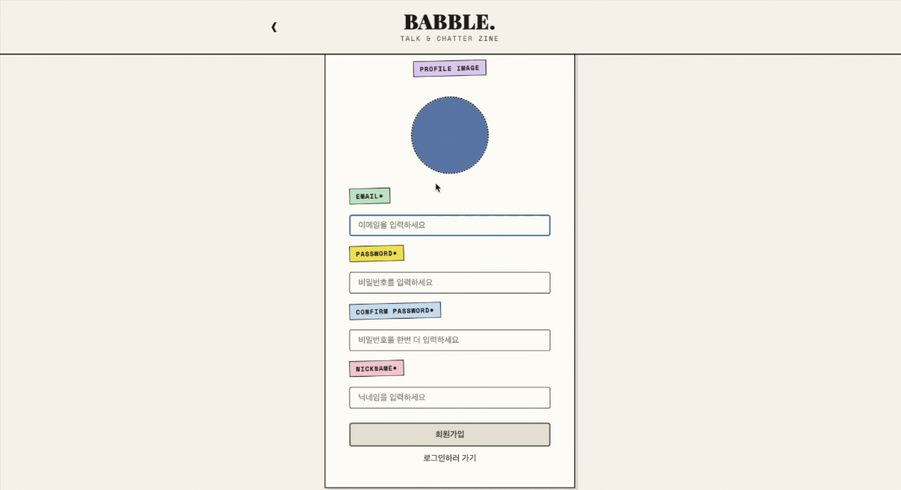 |

### 2. 홈

인기글 Top 5를 자동 슬라이드 캐러셀로, 게시글 목록은 매거진 스타일 카드로 둘러볼 수 있어요.<br>
Contributors로 BABBLE에 기여한 사람들을 확인하고, 프로필 드롭다운으로 어느 페이지에서든 회원정보 수정이나 로그아웃을 바로 할 수 있어요.


<br>

### 3. 게시글 · 댓글 달기

게시글에 댓글을 달고, 내가 쓴 글/댓글은 자유롭게 수정·삭제할 수 있어요. 삭제할 때는 실수로 지우지 않도록 확인 모달이 뜨고, 댓글은 작성자마다 아바타 색이 달라서 누가 남겼는지 한눈에 구분돼요.


| 게시글 작성 | 게시글 수정 | 게시글 삭제 |
|:--:|:--:|:--:|
|  | 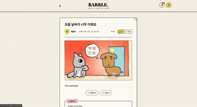 | 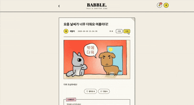 |


| 댓글 작성 | 댓글 수정 | 댓글 삭제 |
|:--:|:--:|:--:|
| 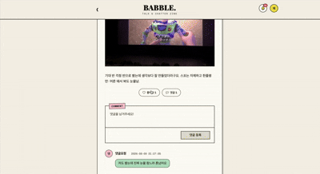 | 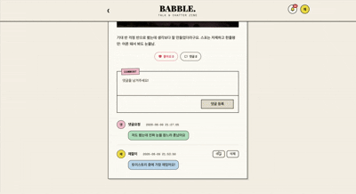 |  |

### 4. 회원 정보 수정 / 탈퇴

| 회원 정보 수정 | 회원 탈퇴 |
|:--:|:--:|
| 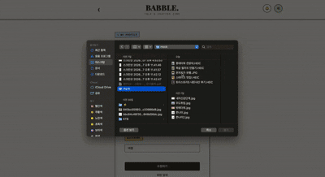 |  |

### 5. 실시간 알림

전체 알림과 읽지 않은 알림을 탭으로 나눠 보고, 한 번에 전체 읽음 처리하거나 모든 알림을 삭제할 수 있어요.

| 전체 알림 / 읽지 않음 탭 | 전체 읽음 처리 | 모든 알림 삭제 |
|:--:|:--:|:--:|
| 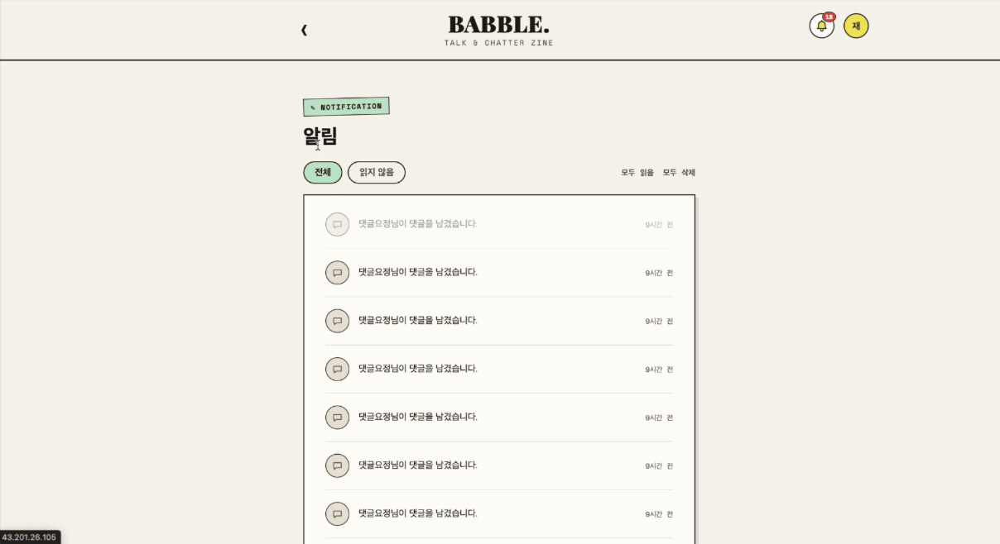 | 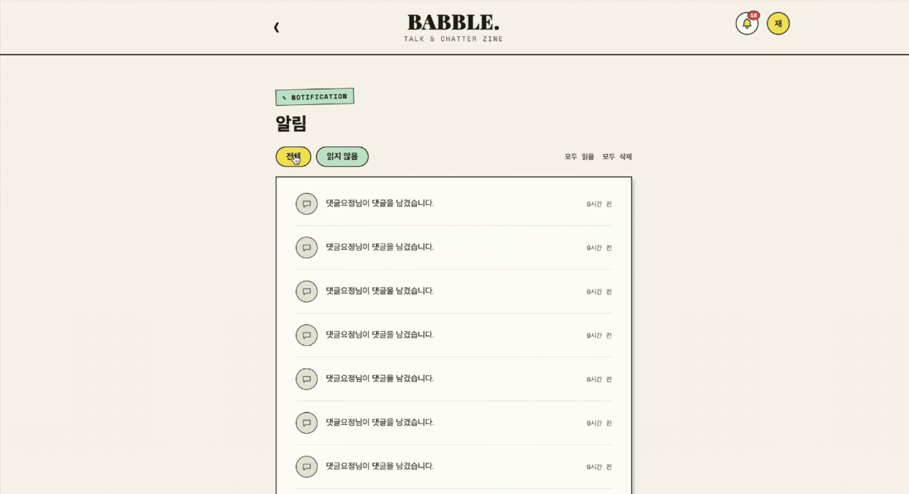 | 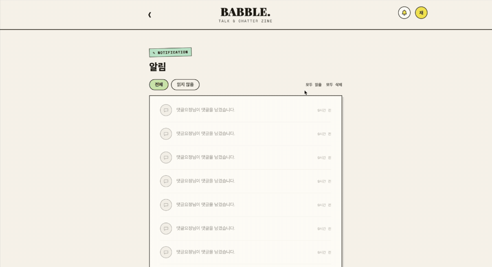 |

<br>

## ⚙️ Tech Stack

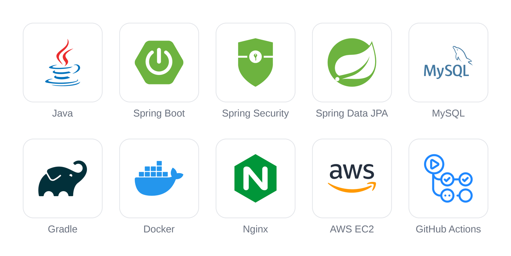


<br>

## 🗂️ Directory Structure

| 폴더명 | 설명 |
|---|---|
| auth | 회원가입/로그인 |
| user | 회원정보 수정, 비밀번호 변경, 회원 탈퇴 |
| post | 게시글 CRUD, 인기글 조회 |
| comment | 댓글 CRUD |
| like | 게시글 좋아요 등록/취소 |
| notification | 알림 생성/조회/읽음 처리, 실시간 push, 만료 알림 자동 삭제 |
| image | 이미지 업로드 |
| jwt | JWT 발급/검증, REST 인증 필터, WebSocket 핸드셰이크 인터셉터 |
| config | Security, WebSocket 설정 |
| common | 공통 API 응답 포맷 |

<details>
<summary>📂 자세한 폴더 구조 (클릭해서 열기)</summary>

```plaintext
community-api/
├── src/
│   ├── main/
│   │   ├── java/org/example/communityapi/
│   │   │   ├── auth/               # 회원가입/로그인
│   │   │   ├── user/               # 회원정보 수정, 비밀번호 변경, 회원 탈퇴
│   │   │   ├── post/               # 게시글 CRUD, 인기글 조회
│   │   │   ├── comment/            # 댓글 CRUD
│   │   │   ├── like/               # 게시글 좋아요 등록/취소
│   │   │   ├── notification/       # 알림 생성/조회/읽음 처리, 웹소켓 실시간 push, 만료 알림 자동 삭제 스케줄러
│   │   │   ├── image/              # 이미지 업로드
│   │   │   ├── jwt/                # JWT 발급/검증, REST 인증 필터, WebSocket 핸드셰이크 인터셉터
│   │   │   ├── config/             # Security, WebSocket 설정
│   │   │   └── common/             # 공통 API 응답 포맷
│   │   └── resources/
│   │       ├── application.properties
│   │       ├── application-docker.properties
│   │       ├── schema.sql
│   │       └── data.sql
│   └── test/
│       └── java/org/example/communityapi/
│           ├── auth/               # 회원가입/로그인 서비스 테스트
│           └── user/               # 회원정보 서비스 테스트
├── uploads/                         # 업로드된 이미지 저장 경로
├── Dockerfile
├── build.gradle
└── .github/
    └── workflows/                  # GitHub Actions 배포 파이프라인
```

</details>

<br>

## 🚀 시작하기

### 필수 환경

- Java 21

```bash
java --version    # Java 21 이상
```

기본 프로필이 H2 인메모리 DB라 로컬에 MySQL/Docker를 따로 설치하지 않아도 바로 실행됩니다.

### 설치 및 실행

**1. Repository 클론**

```bash
git clone https://github.com/soyeong0115/KTB4_Lily_Week4.git
cd KTB4_Lily_Week4
```

**2. 환경변수 설정**

JWT 발급/검증에 쓰는 `JWT_SECRET`이 필요합니다. 저장소에는 값을 포함하지 않으므로 직접 채워서 실행합니다.

```bash
export JWT_SECRET=원하는-비밀-문자열
```

**3. 앱 실행**

```bash
./gradlew bootRun
```

기본 포트는 8080입니다.

### 테스트

```bash
./gradlew test
```

Mockito 기반 단위 테스트라 DB 연결이나 `JWT_SECRET` 설정 없이 바로 실행됩니다.

### MySQL로 실행하려면

`docker` 프로필(`SPRING_PROFILES_ACTIVE=docker`)을 쓰면 MySQL을 사용합니다. 이 경우 백엔드/DB/프론트엔드를 한 번에 띄우는 `docker-compose.yml`은 [프론트엔드 저장소](https://github.com/soyeong0115/KTB4_Lily_Week7)에 있습니다.

<br>

## Architecture

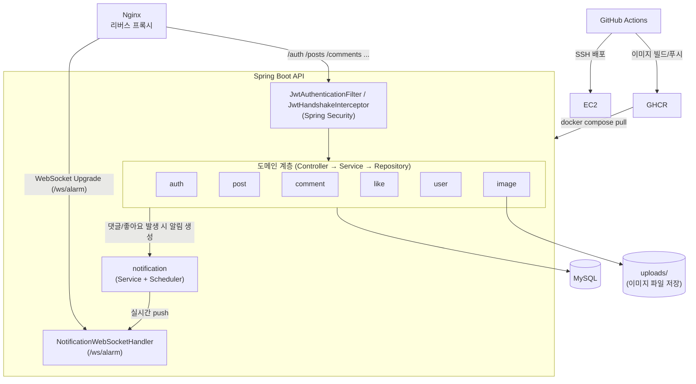

요청은 도메인별 Controller → Service → Repository 계층을 거치고, `JwtAuthenticationFilter`가 REST 요청을, `JwtHandshakeInterceptor`가 WebSocket 연결(`/ws/alarm`)을 각각 인증합니다. 댓글·좋아요 같은 이벤트가 발생하면 `notification` 도메인이 알림을 저장하고 `NotificationWebSocketHandler`를 통해 실시간으로 push합니다(14일 지난 알림은 스케줄러가 자동 삭제). `main` 브랜치 푸시 시 GitHub Actions가 이미지를 빌드해 GHCR에 올린 뒤 EC2에 SSH로 접속해 `docker compose pull && up -d`로 배포합니다.

<br>

## ERD

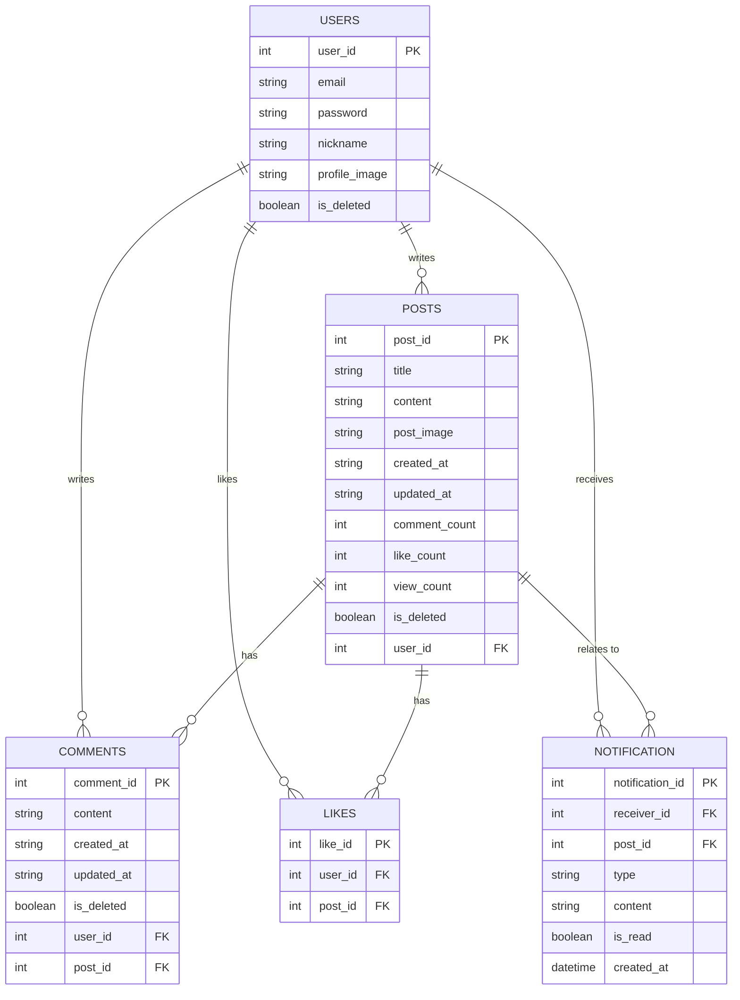

<br>

## 트러블슈팅

<br>

## 프로젝트 회고
